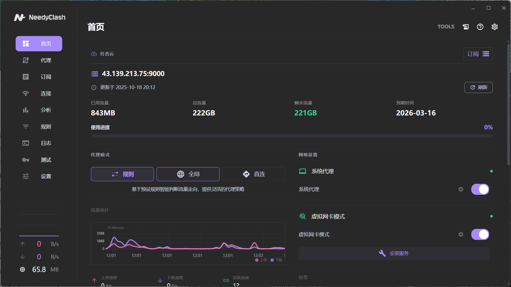
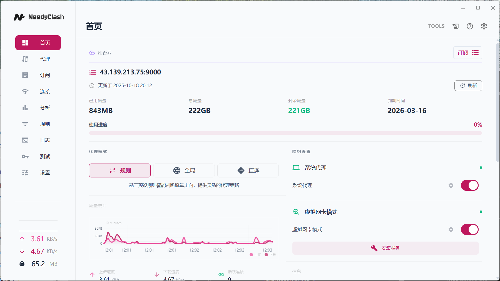
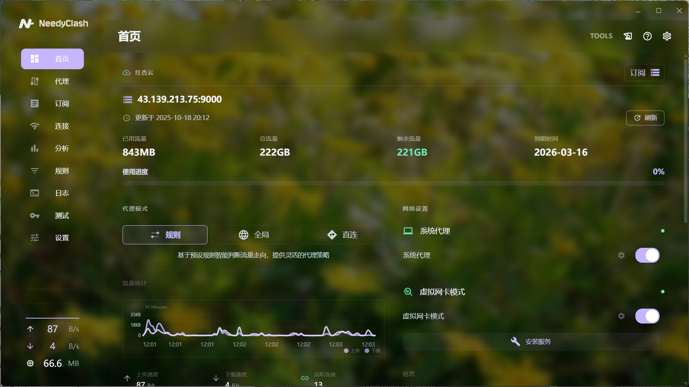
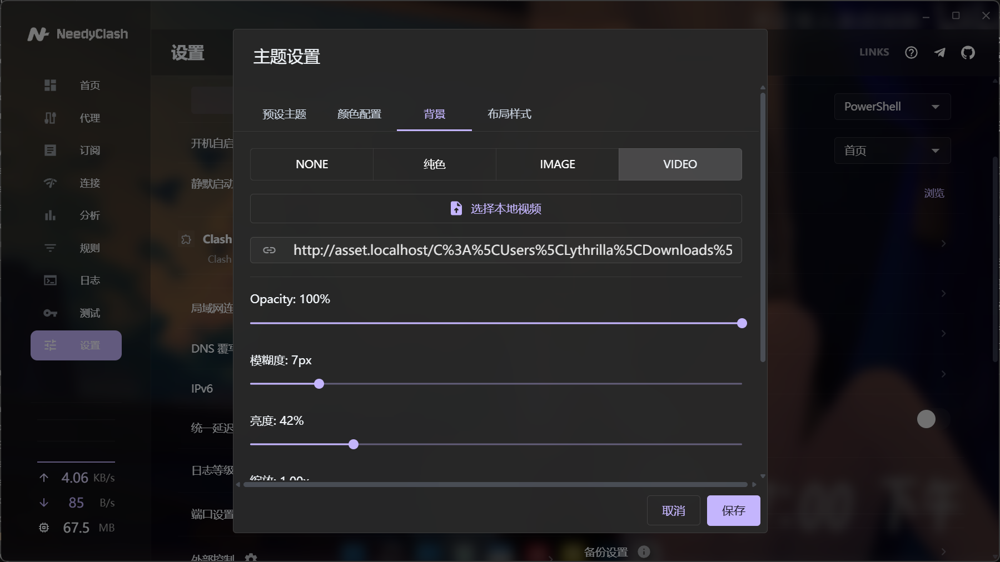

<h1 align="center">
  
  <br/>
  NeedyClash
</h1>

<p align="center">
  <b>世界上最好看的？ Clash 代理客户端</b>
</p>
<p align="center">
<a href="https://t.me/NeedyClash">telegram 群组</a></p>

<p align="center">
  基于 <a href="https://github.com/clash-verge-rev/clash-verge-rev">Clash Verge Rev</a> 深度重构，前后端全面优化，提供更稳定高效的使用体验
</p>

<br>

## 界面预览

<div align="center">
  <table>
    <tr>
      <td></td>
      <td></td>
    </tr>
    <tr>
      <td></td>
      <td></td>
    </tr>
  </table>
</div>

## 项目概述

NeedyClash 源自 [Clash Verge Rev](https://github.com/clash-verge-rev/clash-verge-rev)，经过前后端大规模重构优化。相比原版，在代码架构、性能表现、功能扩展等方面进行了深度改进，提供更稳定高效的使用体验。

### 与原项目的关系

- **独立维护**：不与 Clash Verge Rev 同步代码，独立演进
- **问题反馈**：请在本仓库提交 Issue，勿向原项目反馈
- **长期规划**：计划逐步完全分离为独立项目

## 核心特性

### 订阅管理增强

- **分组系统**：支持创建多个订阅分组，可设置颜色标识
- **智能过滤**：按分组快速筛选和组织配置文件
- **批量操作**：高效管理大量订阅源

### 节点收藏

- 一键标记常用节点
- 批量管理收藏列表
- 跨配置文件快速切换

### 主题系统

全方位的视觉定制能力：

- **颜色方案**：主色调、辅助色、文本色完全自定义
- **背景类型**：图片、视频、纯色三种模式
- **细节控制**：模糊度、透明度、亮度独立调节
- **组件级定制**：导航栏、表头、卡片等元素单独设置
- **方案管理**：内置预设 + 自定义方案保存与分享

### 流量分析

深度的流量监控与分析：

- **实时图表**：上传/下载分离的趋势可视化
- **多维统计**：按域名、进程分别统计流量消耗
- **历史记录**：长期数据存储与回溯
- **数据导出**：JSON 格式，支持二次分析

### 智能提醒

- 自动监控订阅流量配额使用情况
- 可配置的阈值提醒（默认 80%）
- 防骚扰机制：1 小时内不重复提醒
- 剩余流量实时显示

### 稳定性提升

- **全局错误边界**：防止单点故障导致应用崩溃
- **模块化降级**：关键功能独立保护，局部失败不影响整体
- **详细诊断**：完整的错误堆栈和日志系统

---

## 技术架构

### 后端优化

```
• 核心逻辑重构，降低耦合度
• 进程管理优化，提升启动速度
• 配置验证增强，减少无效调用
```

### 前端优化

```
• 组件模块化，避免重复渲染
• SWR 数据缓存策略，减少 API 请求
• 智能节流防抖，优化高频操作性能
```

---

## 致谢

本项目基于以下优秀开源项目构建：

- [Clash Verge Rev](https://github.com/clash-verge-rev/clash-verge-rev) - 原始项目基础
- [Clash Meta](https://github.com/MetaCubeX/mihomo) - 高性能代理内核
- [Tauri](https://tauri.app/) - 轻量级跨平台框架

感谢所有贡献者的付出。

---

## 开源协议

本项目基于 [GPL-3.0](LICENSE) 协议开源。

```
Copyright © 2025 Lythrilla
```

---

<div align="center">

如果觉得项目有帮助，欢迎 Star 支持 ⭐

</div>
