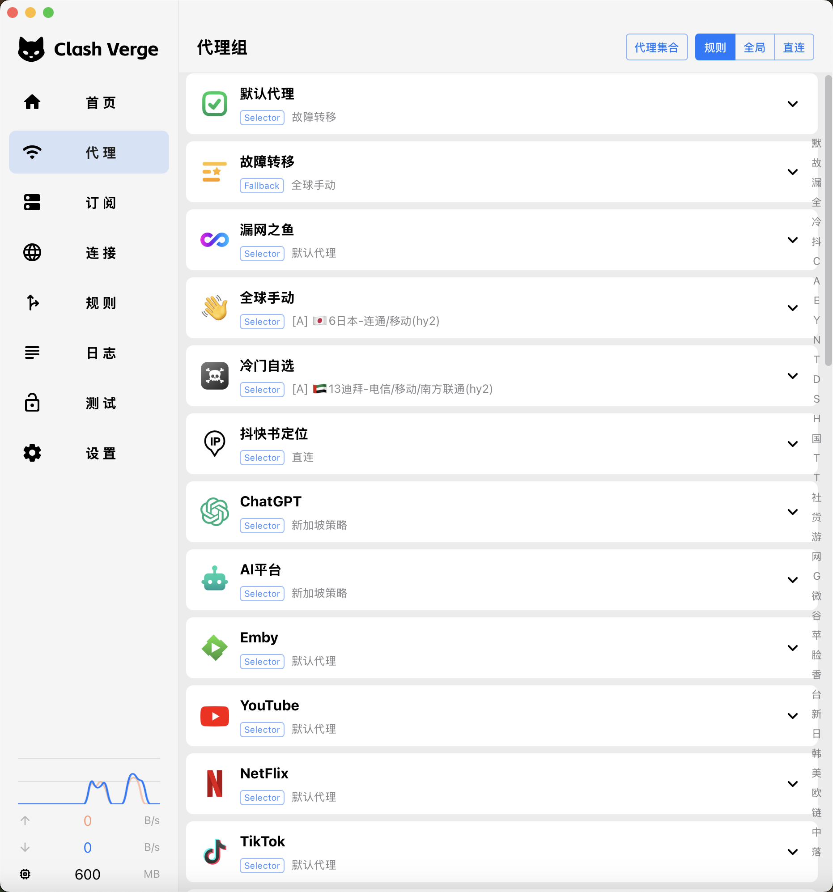

<h1 align="center">
  
  <br>
  NeedyClash
  <br>
</h1>

<h3 align="center">
A secondary development version based on <a href="https://github.com/clash-verge-rev/clash-verge-rev">NeedyClash</a>
<br>
Clash Meta GUI based on <a href="https://github.com/tauri-apps/tauri">Tauri</a>.
</h3>

## Preview

| Dark                             | Light                             |
| -------------------------------- | --------------------------------- |
|  |  |

## About

**NeedyClash** is a secondary development version based on [NeedyClash Rev](https://github.com/clash-verge-rev/clash-verge-rev).

本项目是基于 NeedyClash Rev 的二次开发版本，包含个性化定制和优化。

## Install

Build from source or download from releases (if available).

Supports Windows (x64/x86), Linux (x64/arm64) and macOS 10.15+ (intel/apple).

---

### Original Project

This project is based on **NeedyClash Rev**. For the original project, please visit:

- GitHub: [clash-verge-rev/clash-verge-rev](https://github.com/clash-verge-rev/clash-verge-rev)
- Documentation: [clash-verge-rev.github.io](https://clash-verge-rev.github.io/)
- Telegram: [@clash_verge_rev](https://t.me/clash_verge_re)

## Features

- 基于性能强劲的 Rust 和 Tauri 2 框架
- 内置[Clash.Meta(mihomo)](https://github.com/MetaCubeX/mihomo)内核，并支持切换 `Alpha` 版本内核。
- 简洁美观的用户界面，支持自定义主题颜色、代理组/托盘图标以及 `CSS Injection`。
- 配置文件管理和增强（Merge 和 Script），配置文件语法提示。
- 系统代理和守卫、`TUN(虚拟网卡)` 模式。
- 可视化节点和规则编辑
- WebDav 配置备份和同步

### FAQ

For common issues, refer to the original project's [FAQ Page](https://clash-verge-rev.github.io/faq/windows.html)

## Development

See [CONTRIBUTING.md](./CONTRIBUTING.md) for more details.

To run the development server, execute the following commands after all prerequisites for **Tauri** are installed:

```shell
pnpm i
pnpm run prebuild
pnpm dev
```

## Contributions

Issue and PR welcome!

## Acknowledgement

NeedyClash is based on **NeedyClash Rev** and inspired by these projects:

- [clash-verge-rev/clash-verge-rev](https://github.com/clash-verge-rev/clash-verge-rev): The base project - A Clash Meta GUI continuation.
- [zzzgydi/clash-verge](https://github.com/zzzgydi/clash-verge): The original NeedyClash project.
- [tauri-apps/tauri](https://github.com/tauri-apps/tauri): Build smaller, faster, and more secure desktop applications with a web frontend.
- [MetaCubeX/mihomo](https://github.com/MetaCubeX/mihomo): A rule-based tunnel in Go (Clash Meta core).
- [vitejs/vite](https://github.com/vitejs/vite): Next generation frontend tooling. It's fast!

Special thanks to all contributors of NeedyClash Rev project.

## License

GPL-3.0 License. See [License here](./LICENSE) for details.
